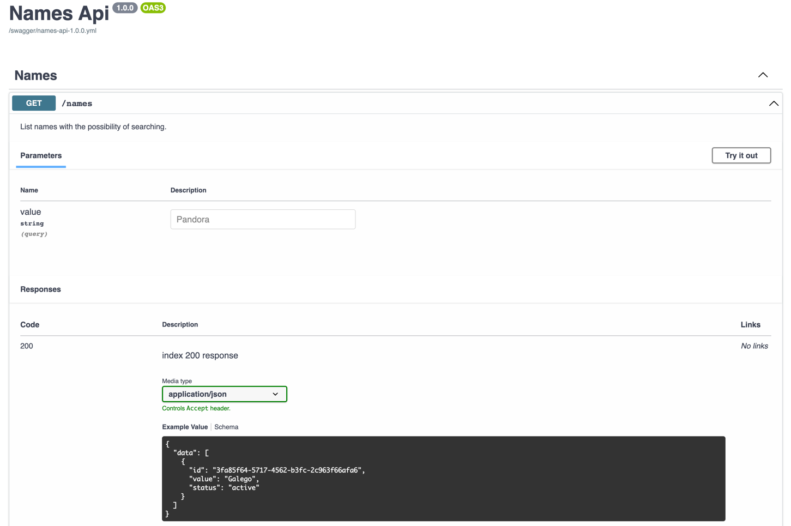

## Micronaut 3.9.4 Documentation

## General
[Api Docs](http://localhost:8080/swagger-ui)

## Feature openapi documentation

- [Micronaut OpenAPI Support documentation](https://micronaut-projects.github.io/micronaut-openapi/latest/guide/index.html)

- [https://www.openapis.org](https://www.openapis.org)

## Feature swagger-ui documentation

- [Micronaut Swagger UI documentation](https://micronaut-projects.github.io/micronaut-openapi/latest/guide/index.html)

- [https://swagger.io/tools/swagger-ui/](https://swagger.io/tools/swagger-ui/)

## Feature http-client documentation

- [Micronaut HTTP Client documentation](https://docs.micronaut.io/latest/guide/index.html#httpClient)

